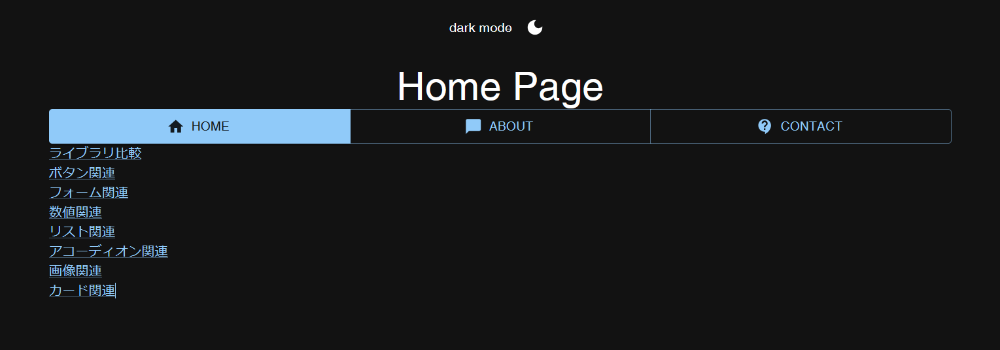

# ここは何？

<!--

**Here are some ideas to get you started:**

🙋‍♀️ A short introduction - what is your organization all about?
🌈 Contribution guidelines - how can the community get involved?
👩‍💻 Useful resources - where can the community find your docs? Is there anything else the community should know?
🍿 Fun facts - what does your team eat for breakfast?
🧙 Remember, you can do mighty things with the power of [Markdown](https://docs.github.com/github/writing-on-github/getting-started-with-writing-and-formatting-on-github/basic-writing-and-formatting-syntax)
-->

NakGummy のプロジェクト置き場。  
公開して困らないものしか基本的に置かないのと、  
リポジトリの Private 設定をするとアカウントを作成してここに加入しないと見れないようになるため、  
すべて公開設定としてある。

## 現状

[00-Introduction](https://github.com/NakGummy/01-React) は断続的に更新。

現在は

- [01-React(dev)](https://github.com/NakGummy/01-React)
  

を開発中
